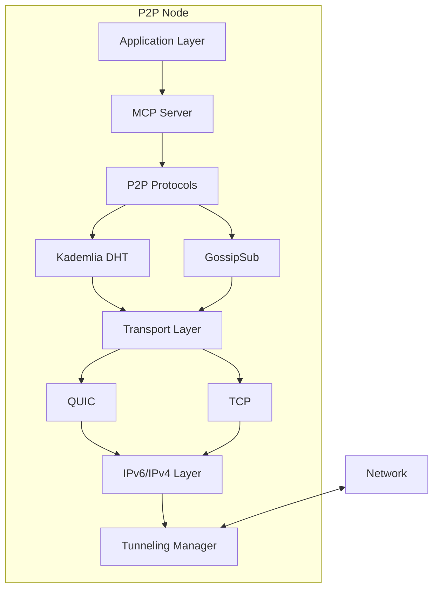

# P2P Foundation Product Requirements Document (PRD)

## Executive Summary

We are building a next-generation peer-to-peer networking foundation in Rust that enables truly decentralized applications with built-in AI capabilities through Model Context Protocol (MCP) servers at each node. This foundation prioritizes IPv6 connectivity, uses modern QUIC transport, and ensures universal accessibility through comprehensive tunneling support.

## Problem Statement

### Current Challenges
1. **Centralized Dependencies**: Existing networked applications rely on central servers, creating single points of failure and control
2. **Limited P2P Tools**: Current P2P libraries lack integrated AI capabilities and modern transport protocols
3. **IPv4 Exhaustion**: Growing network requires IPv6 but lacks comprehensive transition support
4. **AI Integration Complexity**: No standard way to deploy AI agents in P2P networks
5. **NAT Traversal Issues**: Difficulty establishing direct connections between peers behind NATs

### Opportunity
Create a foundational P2P library that enables developers to build decentralized, AI-powered applications with minimal complexity while ensuring universal connectivity through modern protocols.

## Product Vision

"To provide the simplest, most reliable foundation for building decentralized applications where every node can participate as both a client and an AI-powered service provider."

## Goals and Objectives

### Primary Goals
1. **Decentralization**: Enable fully serverless application architectures
2. **AI-Native**: Every node can host and access AI capabilities
3. **Universal Connectivity**: Work on any network through comprehensive protocol support
4. **Developer Friendly**: Simple API with sensible defaults
5. **Production Ready**: Suitable for real-world deployment

### Success Metrics
- **Adoption**: 1000+ GitHub stars within 6 months
- **Performance**: Sub-second P2P connection establishment
- **Reliability**: 99.9% message delivery rate
- **Scale**: Support 10,000+ node networks
- **Developer Experience**: < 50 lines of code for functional P2P app

## User Personas

### 1. Distributed Systems Developer (Primary)
- **Background**: 5+ years experience, familiar with networking
- **Needs**: Reliable P2P primitives, good documentation
- **Pain Points**: Complexity of existing solutions, poor NAT traversal
- **Goals**: Build decentralized applications quickly

### 2. AI Application Developer
- **Background**: ML/AI focus, less networking experience
- **Needs**: Easy AI agent deployment, simple API
- **Pain Points**: Infrastructure complexity, scaling issues
- **Goals**: Deploy AI models across P2P network

### 3. Enterprise Architect
- **Background**: Large-scale system design
- **Needs**: Security, compliance, monitoring
- **Pain Points**: Central points of failure, data sovereignty
- **Goals**: Reduce infrastructure costs and complexity

### 4. Open Source Contributor
- **Background**: Various skill levels
- **Needs**: Clear contribution guidelines, modular codebase
- **Pain Points**: Complex codebases, poor documentation
- **Goals**: Contribute to decentralized future

## User Stories

### Core Functionality
1. **As a developer**, I want to create a P2P node with minimal configuration so that I can focus on my application logic
2. **As a developer**, I want automatic NAT traversal so that my application works without manual network configuration
3. **As a developer**, I want to discover and connect to peers automatically so that I don't need to manage peer lists

### MCP Integration
4. **As an AI developer**, I want to expose my model as an MCP service so that other peers can use it
5. **As an AI developer**, I want to discover and use AI services on other peers so that I can build distributed AI applications
6. **As a developer**, I want to route AI requests efficiently so that I get fast responses

### Network Features
7. **As a network admin**, I want comprehensive IPv6 support with IPv4 fallback so that my application works on any network
8. **As a developer**, I want encrypted communications by default so that my application is secure without extra work
9. **As a developer**, I want built-in metrics and monitoring so that I can observe my P2P network

## Technical Requirements

### Functional Requirements

#### Core Networking
- **F1**: Implement Kademlia DHT for peer discovery and routing
- **F2**: Support QUIC transport with 0-RTT connections
- **F3**: Provide TCP fallback for restrictive networks
- **F4**: Enable UDP hole punching for NAT traversal
- **F5**: Support relay nodes for impossible NAT scenarios

#### IPv6 and Tunneling
- **F6**: Default to IPv6 for all communications
- **F7**: Support ALL major tunneling protocols (Teredo, 6to4, DS-Lite, etc.)
- **F8**: Automatic tunnel selection based on network conditions
- **F9**: Transparent fallback when native IPv6 unavailable

#### MCP Server
- **F10**: Embed MCP server in each node
- **F11**: Automatic service registration in DHT
- **F12**: Service discovery with capability filtering
- **F13**: Request routing with automatic failover
- **F14**: Support for custom MCP tools

#### Developer Experience
- **F15**: Single binary with no external dependencies
- **F16**: Sensible defaults that work out of the box
- **F17**: Comprehensive examples and documentation
- **F18**: Language bindings for Python, JavaScript
- **F19**: CLI tools for testing and debugging

### Non-Functional Requirements

#### Performance
- **P1**: < 100ms connection establishment (LAN)
- **P2**: < 1s connection establishment (Internet)
- **P3**: > 100 Mbps throughput per connection
- **P4**: < 100MB memory baseline
- **P5**: Support 1000+ concurrent connections

#### Security
- **S1**: End-to-end encryption for all communications
- **S2**: Perfect forward secrecy
- **S3**: Peer authentication via Ed25519
- **S4**: DDoS resistance through rate limiting
- **S5**: Capability-based access control

#### Reliability
- **R1**: Automatic reconnection on network changes
- **R2**: Message delivery confirmation
- **R3**: Data integrity verification
- **R4**: Graceful degradation under load
- **R5**: Comprehensive error handling

#### Usability
- **U1**: Clear, actionable error messages
- **U2**: Progressive disclosure of complexity
- **U3**: Extensive logging and debugging tools
- **U4**: Interactive documentation
- **U5**: Video tutorials and guides

## Architecture Overview

### High-Level Components



### Key Design Decisions

1. **Rust-First**: Memory safety and performance
2. **libp2p Base**: Battle-tested P2P primitives
3. **Quinn for QUIC**: Pure Rust implementation
4. **Modular Architecture**: Each layer independently useful
5. **Zero-Copy Design**: Minimize allocations

## Development Roadmap

### MVP (Months 1-2)
- Basic P2P connectivity with libp2p
- Kademlia DHT implementation
- Simple MCP server integration
- IPv6 with basic tunneling (Teredo)
- Example applications

**Deliverables**:
- Working P2P library
- Basic documentation
- 3 example applications

### Beta (Months 3-4)
- Complete tunneling support
- Production-grade MCP implementation
- Monitoring and metrics
- Security hardening
- Performance optimization

**Deliverables**:
- Feature-complete library
- Comprehensive documentation
- Benchmarking suite
- Security audit report

### v1.0 Release (Months 5-6)
- API stabilization
- Language bindings
- Production deployments
- Community building
- Enterprise features

**Deliverables**:
- Stable API
- Multi-language support
- Production case studies
- Community forum

### Future Versions
- Blockchain integration
- Mobile optimizations
- Hardware acceleration
- Advanced routing algorithms
- Specialized MCP tools

## API Design

### Core API
```rust
// Simple node creation
let node = P2PNode::new()
    .with_mcp_server()
    .listen_on("/ip6/::/tcp/9000")
    .build().await?;

// Service registration
node.register_mcp_service("my-ai-model", vec![
    Tool::new("generate_text").with_schema(schema),
    Tool::new("analyze_image").with_schema(schema),
]).await?;

// Peer communication
let response = node.call_peer(peer_id, "generate_text", params).await?;

// Broadcast to network
node.publish("topic/ai-models", announcement).await?;
```

### Configuration API
```rust
let config = P2PConfig::builder()
    .network(NetworkConfig::ipv6_only())
    .tunneling(TunnelingConfig::auto())
    .mcp(MCPConfig::default())
    .security(SecurityConfig::strict())
    .build()?;

let node = P2PNode::with_config(config).await?;
```

## Testing Strategy

### Test Levels
1. **Unit Tests**: All core functions (80% coverage)
2. **Integration Tests**: Multi-node scenarios
3. **Performance Tests**: Throughput and latency
4. **Chaos Tests**: Network failures and partitions
5. **Security Tests**: Penetration testing

### Test Environments
- **Local**: Docker-based test networks
- **CI/CD**: GitHub Actions matrix
- **Staging**: Global test network
- **Canary**: Gradual production rollout

## Go-to-Market Strategy

### Phase 1: Developer Community
- Open source from day one
- Comprehensive documentation
- Example applications
- Developer evangelism
- Conference talks

### Phase 2: Early Adopters
- Partner with P2P projects
- Integration guides
- Success stories
- Community support
- Bug bounty program

### Phase 3: Mainstream Adoption
- Enterprise support
- SLA guarantees
- Professional services
- Training programs
- Certification

## Success Metrics

### Technical Metrics
- Connection success rate > 95%
- Message delivery rate > 99.9%
- P99 latency < 500ms
- Memory usage < 100MB
- CPU usage < 5% idle

### Adoption Metrics
- GitHub stars: 1000+ (6 months)
- Active contributors: 50+
- Production deployments: 100+
- npm/crates.io downloads: 10k/month
- Community size: 1000+ members

### Business Metrics
- Enterprise customers: 10+ (Year 1)
- Support revenue: $500k (Year 1)
- Training revenue: $200k (Year 1)
- Consulting pipeline: $1M
- Feature sponsorship: $300k

## Risk Analysis

### Technical Risks
1. **NAT Traversal Failures**
   - Mitigation: Comprehensive relay infrastructure
2. **Protocol Complexity**
   - Mitigation: Phased implementation
3. **Performance Issues**
   - Mitigation: Early benchmarking
4. **Security Vulnerabilities**
   - Mitigation: Security audits

### Market Risks
1. **Slow Adoption**
   - Mitigation: Strong developer relations
2. **Competition**
   - Mitigation: Unique MCP integration
3. **IPv6 Adoption**
   - Mitigation: Comprehensive tunneling

### Operational Risks
1. **Maintainer Burnout**
   - Mitigation: Sustainable funding
2. **Community Fragmentation**
   - Mitigation: Clear governance
3. **Scope Creep**
   - Mitigation: Focused roadmap

## Resource Requirements

### Development Team
- 2 Senior Rust Engineers
- 1 Network Protocol Specialist
- 1 Security Engineer
- 1 Developer Advocate
- 1 Technical Writer

### Infrastructure
- CI/CD pipeline
- Global test network
- Documentation hosting
- Community forums
- Security scanning

### Budget (Year 1)
- Development: $800k
- Infrastructure: $100k
- Security audits: $100k
- Marketing: $200k
- **Total**: $1.2M

## Appendices

### A. Competitive Analysis
- libp2p: Great foundation, lacks MCP and modern transport
- IPFS: Storage-focused, heavyweight
- Matrix: Application-layer, not foundational
- WebRTC: Browser-focused, complex

### B. Technical Standards
- RFC 9000 (QUIC)
- RFC 8445 (ICE)
- RFC 6762 (mDNS)
- Model Context Protocol Specification

### C. Glossary
- **DHT**: Distributed Hash Table
- **MCP**: Model Context Protocol
- **NAT**: Network Address Translation
- **QUIC**: Quick UDP Internet Connections
- **P2P**: Peer-to-Peer

## Document Control

- **Version**: 1.0
- **Last Updated**: 2024-01-20
- **Author**: P2P Foundation Team
- **Approval**: Pending
- **Next Review**: 2024-02-20